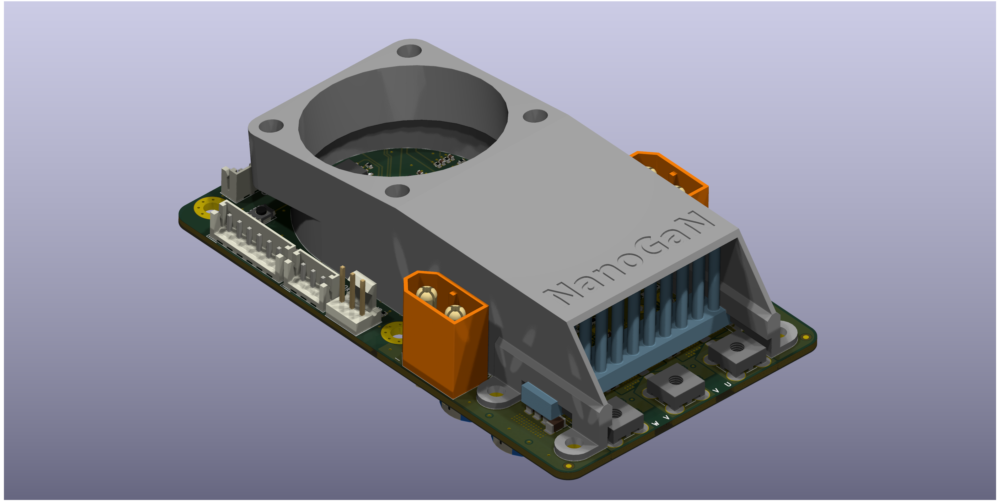
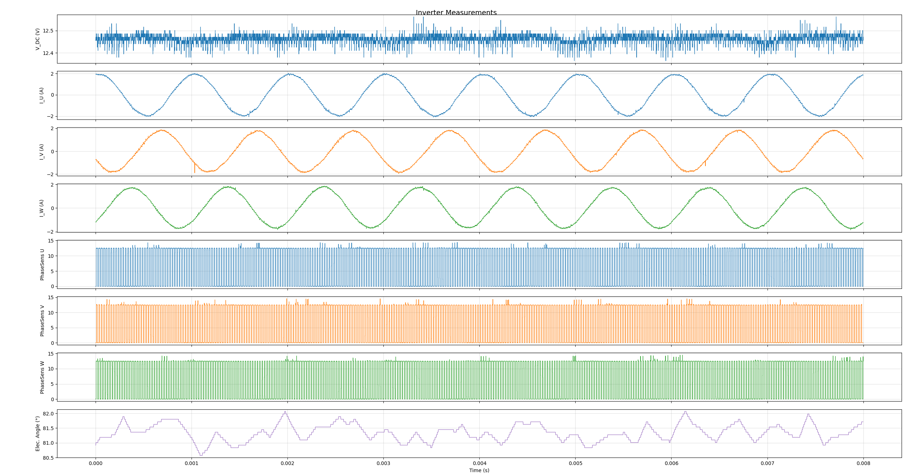

# NanoGaN

GaN-based motor driver using Infineon's latest GaN switches. Supports up to 60V (depending on GaN device selection).

## Project Structure

- `NanoGaN.kicad_sch` - Main schematic file
- `NanoGaN.kicad_pcb` - PCB layout
- `half_bridge.kicad_sch` - Half bridge circuit schematic
- `power.kicad_sch` - Power supply schematic
- `mcu.kicad_sch` - Microcontroller schematic
- `connectors.kicad_sch` - Connector schematic

## Folders

- `board/` - 3D board render and PDF schematic
- `NanoGaN_3D_models/` - Component 3D models
- `NanoGaN.pretty/` - Custom footprints and symbols
- `production/` - BOM, netlist, and pick & place files
- `microcontroller/` - MCU configuration and interrupt table
- `documents/` - Additional documentation

## Building

Open `NanoGaN.kicad_pro` in KiCad to view the project. Main PCB file is `NanoGaN.kicad_pcb`.

## Interfaces

- ST-Link V3 MINIE (STDC14) - Debugging and reprogramming
- 10k NTC (x2)
- SPI/I2C/USART (mutually exclusive)
- Hall Sensor Connectors - Motor commutation feedback with filtering
- Fan Connector - Cooling fan control for 5V fans
- USB-C - Communication and configuration
- CAN Bus - Motor control and diagnostics
- Servo - Servo interface

## Production Files

Standard manufacturing outputs are in the `production/` folder:
- `bom.csv` - Bill of materials
- `positions.csv` - Pick and place coordinates
- `netlist.ipc` - IPC netlist
- `designators.csv` - Component designators

## Notes

GaN motor driver with Infineon GaN switches. Supports up to 60V depending on device selection. MCU is configured via `NanoGaN.ioc` (STM32CubeMX format).

## Example HF injection to 24V BLDC Motor
